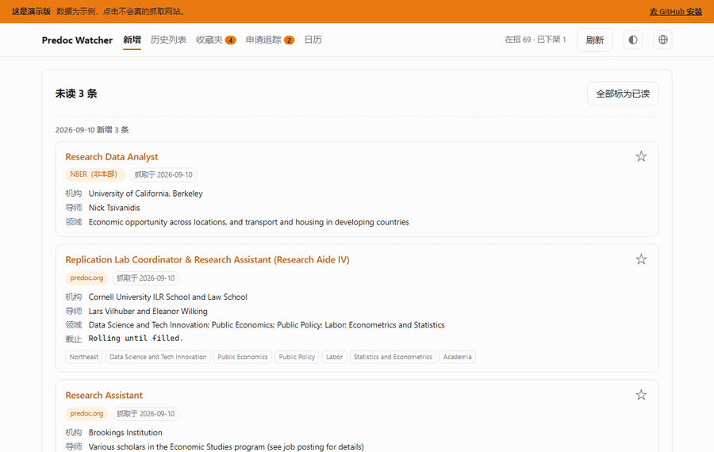

# Predoc Watcher

[English](README.md) · **中文**

把三个 pre-doc / RA 招聘页做成一个能搜索、收藏、提醒、追踪申请进度的桌面软件。

自带抓取和本地数据库，装完即用。不需要 API key、邮箱或任何账号。



**[在浏览器里直接试用](https://claude.ai/code/artifact/4c78e2a9-6060-4889-bd3e-9f78ede18096)** —— 示例数据的在线 Demo，不用安装。

| 来源 | 页面 |
|---|---|
| predoc.org | <https://www.predoc.org/opportunities> |
| NBER（本部） | <https://www.nber.org/career-resources/research-assistant-positions-nber> |
| NBER（非本部） | <https://www.nber.org/career-resources/research-assistant-positions-not-nber> |

> 只想每天收一封邮件、不要界面，见
> [predoc-watcher-email](https://github.com/ruanyn2025/predoc-watcher-email)。
> 两者互相独立，可只用其一。

## 安装

需要 Python 3.9 或更高版本（[下载](https://www.python.org/downloads/)，Windows 安装时勾选
"Add Python to PATH"）。

```bash
git clone https://github.com/ruanyn2025/predoc_watcher_app.git
cd predoc_watcher_app
pip install -r requirements.txt
```

窗口和托盘功能在 Windows 上开发和验证。Mac 和 Linux 可以运行纯网页版，见下方「只要网页版」。

## 启动

双击 `启动.bat`，或运行 `python desktop.py`。

第一次启动会抓取三个网站并建立本地数据库，需要几秒钟。

**关闭窗口不等于退出。** 点 ✕ 只是缩到系统托盘，程序继续在后台检查新岗位。左键托盘图标可以把窗口叫回来，右键选「退出」才真正关闭。重复双击 `启动.bat` 也只会叫回已有窗口。

### 装进开始菜单

```powershell
.\install_shortcut.ps1
```

```powershell
.\install_shortcut.ps1 -Desktop     # 加一个桌面快捷方式
.\install_shortcut.ps1 -Startup     # 开机自启，启动时直接缩到托盘
.\install_shortcut.ps1 -Uninstall   # 全部移除
```

### 指定 Python 解释器

默认使用 PATH 里的 `pythonw`，多数情况不需要配置。只有当 Python 装在 conda 环境或虚拟环境里、不在 PATH 上时才需要指定。三种方式，按优先级：

| 方式 | 怎么做 |
|---|---|
| 环境变量 | 设 `PREDOC_PYTHON` 为解释器完整路径 |
| `python_path.txt` | 在项目目录下新建这个文件，写入一行完整路径 |
| PATH | 不做任何配置 |

用虚拟环境时：

```powershell
python -m venv .venv
.venv\Scripts\pip install -r requirements.txt
```

然后把解释器路径写进 `python_path.txt`，用 `pythonw.exe` 可以避免启动时弹出黑框：

```
C:\完整路径\.venv\Scripts\pythonw.exe
```

先激活虚拟环境再双击启动是无效的，双击会开一个新进程，继承不到终端里激活的环境，所以路径必须写进文件。

### 后台行为

启动时抓取一次，缩到托盘时再抓一次，之后每 6 小时自动抓取。发现新岗位会弹出托盘通知。

### 只要网页版

不需要窗口和托盘的话直接运行 `app.py`，用浏览器打开 <http://127.0.0.1:8765/>：

```bash
python app.py
```

这种方式不需要安装 pywebview 和 pystray。

## 五个页面

**新增** —— 上次「标为已读」之后出现的新岗位，按抓取日期分组。顶部显示未来 7 天内到期的提醒，剩 3 天以内标红。

**历史列表** —— 全部岗位，含已下架的。搜索框同时匹配领域、导师、学校学院和标题；空格分隔的多个关键词按「同时满足」处理，例如 `labor harvard` 会同时命中领域和机构。也可以按来源和在招状态筛选。

**收藏夹** —— 点 ☆ 收藏，按提醒日期排序。每张卡片右上角的 **✎ 编辑** 可以修改提醒日期和备注。点亮着的 ★ 取消收藏。

**申请追踪** —— 在收藏夹点「完成投递」，岗位移到这里。每条可以：

- 切换**申请阶段**：已投递 / 笔试 · code test / 面试 / 结束。页面按阶段分组，「结束」的折到底部。
- 记**多个带名字的时间点**，例如「code test 截止 9/18」「一面 9/25 10:00」。
- 写**备注**和**相关链接**，链接可自定义名称，点击用系统浏览器打开。
- 顶部显示投递日期和已过天数。

时间、备注、链接这三栏在收藏夹页面同样可用，还没投递的岗位也能记。撤回投递会退回收藏夹，已写的标注不会删除。

**日历** —— 月历视图，显示所有提醒和申请时间点，可翻月。7 天内的用实心标记，更远的用浅底。光标停在标记上会浮出机构和导师，点击跳回对应的收藏夹或申请追踪页。

## 收藏时的提醒日期

点 ☆ 收藏时会弹出一个面板，需要你确认提醒日期。这是因为招聘页的截止日期字段很不规范：超过一半的岗位根本没有这个字段，写了的也常常是 rolling、缺年份或已经过期。

面板里会显示原始的截止信息，并预填一个提醒日期：能读出未来日期的就用那个日期，读不出的预填 7 天后。可以用快捷按钮调整，或直接改日期框。回车确认，Esc 取消。

## 外观与语言

右上角两个按钮：半明半暗的圆切换主题，地球切换语言。

主题有跟随系统、浅色、深色三种。语言支持简体中文、繁體中文、English、Français、Español。两项选择都存在本地数据库里，下次打开保持不变。

日历上两类标记的颜色可以自定义：点底部图例的小色块，可以从七个预设色中选，也可以用取色器或直接填十六进制。

## 命令

| 命令 | 作用 |
|---|---|
| `python desktop.py` | 正常启动 |
| `python desktop.py --minimized` | 启动后直接缩到托盘 |
| `python desktop.py --interval 6` | 后台自动检查的间隔小时数，默认 6 |
| `python desktop.py --no-fetch` | 启动时不抓取 |
| `python desktop.py --port 8000` | 换端口 |
| `python app.py` | 只启动网页版 |

## 排错

**打不开页面。** 端口 8765 可能被占用，换一个：`python app.py --port 8000`。

**提示某个来源抓取失败。** 偶尔出现通常是网络问题，该来源的岗位会原样保留，不会丢失或被误标为下架。如果连续多次出现，多半是网站改版了，解析代码需要更新。

**报 CERTIFICATE_VERIFY_FAILED。** predoc.org 的服务器漏发了一张中间证书。`extra_ca/gdig2.pem` 就是补上的那张，程序运行时会自动合并使用，证书校验始终是开启的。如果这个文件缺失或损坏，重新克隆一份即可。

**想清空重来。** 删掉 `jobs.db` 再启动会重新建库，但收藏、提醒和申请记录会一起丢失。

## 文件

```
desktop.py            桌面外壳：窗口与系统托盘
app.py                网页服务
fetch.py              抓取与解析三个网站
db.py                 数据库结构与查询
ingest.py             把抓取结果写入数据库
deadlines.py          截止日期解析
i18n.py               界面文案，五种语言
calcolors.py          日历配色推导
make_icon.py          生成图标
install_shortcut.ps1  安装开始菜单快捷方式
templates/            页面模板
static/               样式与前端脚本
extra_ca/gdig2.pem    predoc.org 缺失的中间证书
app.ico               应用图标
jobs.db               你的数据：岗位、收藏、提醒、申请记录
python_path.txt       你的解释器路径（可选）
启动.bat              双击启动
```

`jobs.db` 和 `python_path.txt` 已列入 `.gitignore`，不会被提交。

## 限制

- 网站不提供岗位发布日期，卡片上的「抓取于」是本软件首次看到该岗位的日期。
- 历史记录从你第一次运行的那天开始积累，更早的岗位无法补录。
- 第一次运行抓到的岗位全部记为存量，不会算作新增。
- 窗口和托盘功能只在 Windows 上验证过。

## 更新记录

新的在上面。只记录会影响使用的改动。

### 2026-09-10

- README 加上演示动图和可点击的在线 Demo。

## 许可证

MIT，见 [LICENSE](LICENSE)。
